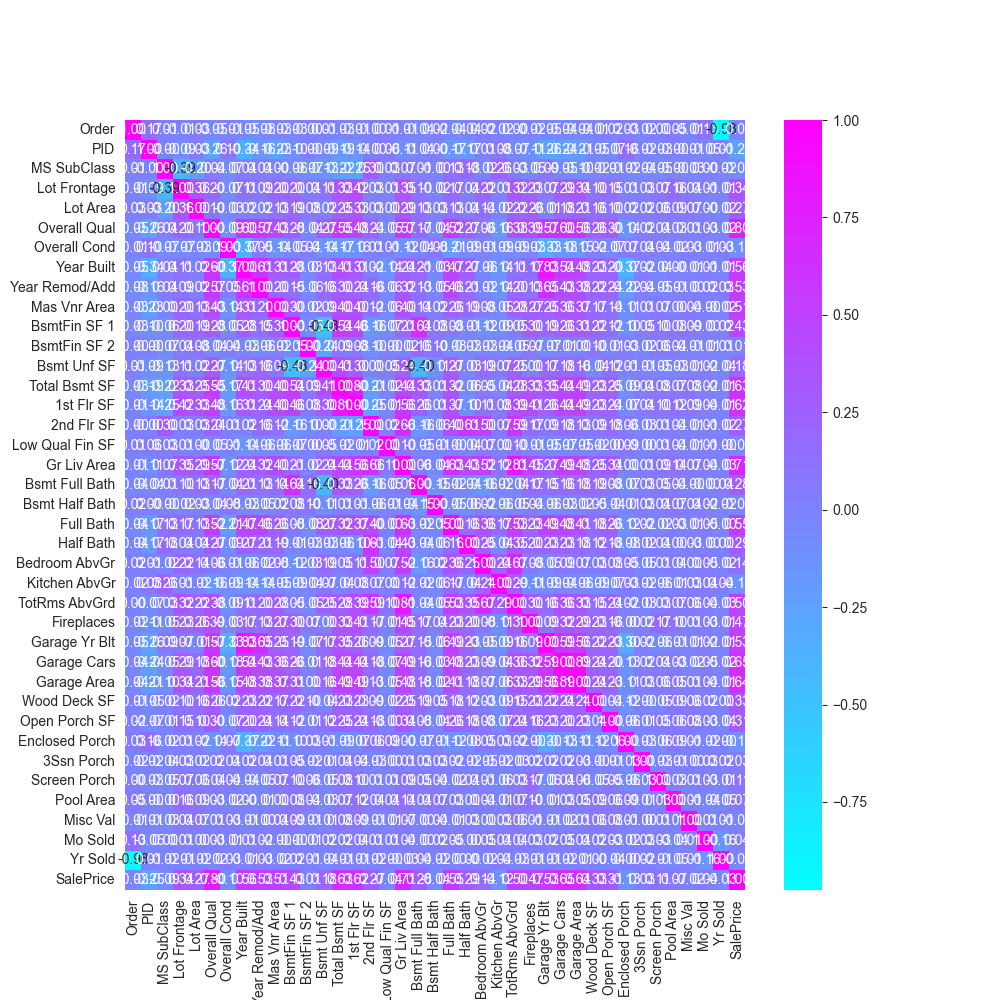

# Ames House Price Prediction with XGBoost 🏡
An end-to-end machine learning project to predict house prices using the Ames Housing dataset. This repository covers the complete data science pipeline: data cleaning, exploratory analysis, feature engineering, and modeling with XGBoost.

This project is a comprehensive dive into the Ames Housing dataset, with the goal of predicting the final sale price of homes. It demonstrates a complete machine learning workflow, from initial data exploration to final model interpretation.

---

## 🚀 Project Workflow

The project follows a structured approach to ensure the data is well-understood and the model is robust.

1.  **Data Cleaning & Imputation**: The process began with handling missing values. For instance, `Lot Frontage`, a feature with a skewed distribution, was imputed using its median value to maintain data integrity without being skewed by outliers.

2.  **Exploratory Data Analysis (EDA)**: I used visualizations like histograms, heatmaps, and boxplots to uncover patterns, identify correlations between features, and understand the overall data distribution. The correlation heatmap was particularly useful for identifying key relationships, such as the strong positive correlation between `OverallQual` and `SalePrice`.

To begin the analysis, I generated a correlation heatmap to get a high-level understanding of how the numerical features relate to each other and to the `SalePrice`. This helped in quickly identifying multi-collinearity and the features that were most promising for prediction.

3.  **Feature Engineering**: This was a critical step to enhance the model's predictive power. I created several new, intuitive features from the existing data:
    * `TotalSF`: A combined measure of total square footage (Basement + 1st Floor + 2nd Floor).
    * `TotalBath`: A weighted sum of all full and half bathrooms.
    * `HouseAge`: The age of the house at the time of sale.
    * `YearsSinceRemod`: The number of years between the last remodel and the sale.

4.  **Outlier Removal**: To prevent extreme values from disproportionately influencing the model, I systematically removed outliers from key numerical features using the Interquartile Range (IQR) method.

5.  **Modeling with XGBoost**: I trained an `XGBoost Regressor`, a powerful and efficient gradient-boosting algorithm, to learn the complex patterns in the data and predict sale prices.

6.  **Model Evaluation & Interpretation**: The model's performance was evaluated on a held-out test set using R-squared (R²) and Root Mean Squared Error (RMSE). Finally, I analyzed the feature importances to understand which factors were the most influential in determining a home's value.

---

## 📊 Key Results

* The final model achieved an **R-squared score of [Your R² Score Here]** on the test set.
* The feature importance analysis revealed that `OverallQual`, `TotalSF`, and `GrLivArea` were the most significant predictors of a home's sale price, confirming that overall quality and size are paramount.

---

## 🛠️ Technologies Used

* Python
* Pandas & NumPy for data manipulation
* Matplotlib & Seaborn for visualization
* Scikit-learn for data preprocessing and evaluation
* XGBoost for the regression model
